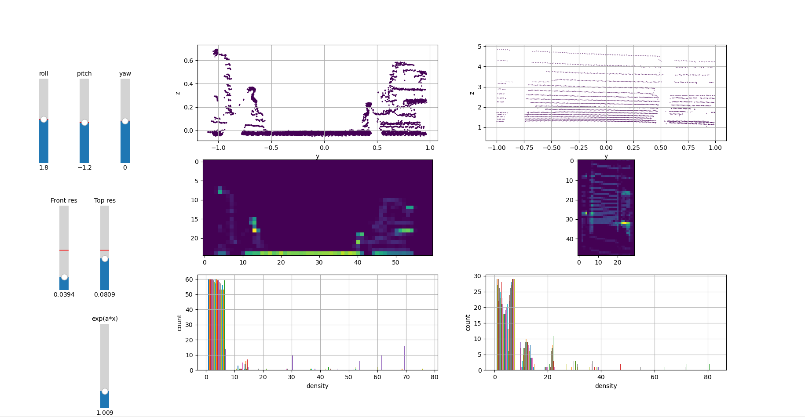

# pointcloud_density_analyzer
Pointcloud Density Analizer is used to segment a pointcloud on the basis of the projection of points on the XZ and XY planes.
It is possible to rotate the pointcloud, set the 2D histograms resolutions and multiply top view histogram by the exponetian function to normalize the densities relative to distance from 3D LiDaR.

# Usage
```bash
git clone https://github.com/delipl/pointcloud_density_analyzer
cd pointcloud_density_analyzer
python3 pointcloud_density_analyzer.py
```

